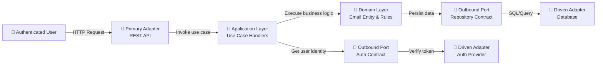

# Project Architecture Overview

## Metadata
- Updated: 2026-05-07
- Author Agent: Software Architect
- Related User Stories: US-0001, US-0002, US-0003, US-0004, US-0005
- Related Technical Requirements: TREQ-0001, TREQ-0002, TREQ-0003, TREQ-0004, TREQ-0005, TREQ-0006, TREQ-0007, TREQ-0009, TREQ-0010, TREQ-0011, TREQ-0012 (TREQ-0008 Deprecated)

## Architectural Style and Principles
- **Style**: Hexagonal Architecture (Ports and Adapters)
- **Key Principles**: 
  - Separation of concerns: domain logic isolated from technical infrastructure
  - Low coupling: modules communicate through well-defined contracts
  - High cohesion: each module has a single, clear responsibility
  - Testability: business logic decoupled from frameworks and databases
  - Explicit contracts: all module interactions are clearly defined

## System Context
- **Primary Actors**: Authenticated business users managing email records
- **Primary Use Cases**: Create, read, update, and permanently delete email records
- **External Systems**: 
  - Authentication provider (identity verification)
  - Persistent data store (database)

## System-Level Architecture

## Module and Boundary Map

### Primary Adapter Layer (Inbound)
| Module | Responsibility | Owns |
|--------|-----------------|------|
| **REST API Adapter** | HTTP endpoint handling, request routing, response serialization | Email CRUD endpoints (POST, GET, PUT, DELETE) |

### Application Layer (Business Orchestration)
| Module | Responsibility | Owns |
|--------|-----------------|------|
| **Use Case: CreateEmailRecord** | Orchestrate email creation, validate input, trigger domain logic | User authentication check, audit capture, response assembly |
| **Use Case: ReadEmailRecord** | Orchestrate single-record retrieval | User authentication check, response assembly |
| **Use Case: ListEmailRecords** | Orchestrate list retrieval | User authentication check, pagination contract (baseline: no filters/sort) |
| **Use Case: UpdateEmailRecord** | Orchestrate email update, validate input, trigger domain logic | User authentication check, audit capture, response assembly |
| **Use Case: HardDeleteEmailRecord** | Orchestrate permanent record deletion | User authentication check, deletion confirmation |

### Domain Layer (Business Logic)
| Module | Responsibility | Owns |
|--------|-----------------|------|
| **Email Entity** | Email record business rules, value constraints, domain events | Entity identity (id), email value (email address), lifecycle (created, updated) |
| **Audit Attribution** | Track actor identity on changes | createdBy field (who created), updatedBy field (who last updated) |

### Outbound Ports & Contracts
| Port | Responsibility | Contract |
|------|-----------------|----------|
| **Repository Port** | Data persistence abstraction | interface EmailRepository { save(), findById(), findAll(), delete() } |
| **Authentication Port** | User identity resolution | interface AuthProvider { getCurrentUser() → User { id, name, email } } |
| **Audit Logger Port** | Attribution and audit trail | interface AuditLogger { log(action, actor, entity) } |

### Driven Adapter Layer (Outbound)
| Module | Responsibility | Owns |
|--------|-----------------|------|
| **Database Adapter** | SQL queries, connection pooling, transaction management | Email table schema, persistence logic |
| **Authentication Adapter** | Token validation, user lookup | Integration with auth provider (JWT, OAuth, etc. — decided at Gate 3) |
| **Audit Logger Adapter** | Event capture and logging | Audit trail storage |

## Runtime Interaction Flows

### Flow 1: Create Email Record
1. User sends HTTP POST to `/emails` with `{ value: "user@example.com" }`
2. **REST API Adapter** deserializes request, extracts user context
3. **CreateEmailRecord Use Case** receives user, email value
4. **Authentication Port** resolves current user identity (authenticated)
5. **Email Domain** validates email value, creates entity with generated id
6. **Audit Attribution** sets createdBy = current user id, created timestamp
7. **Repository Port** saves entity to database
8. **REST API Adapter** serializes response body: `{ id, value }` (internal metadata in Last-Modified header: RFC 7231 timestamp)
9. User receives HTTP 201 with created record + Last-Modified header

### Flow 2: Read Email Record
1. User sends HTTP GET to `/emails/{id}`
2. **REST API Adapter** extracts id, user context
3. **ReadEmailRecord Use Case** receives user, email id
4. **Authentication Port** verifies user identity
5. **Repository Port** retrieves record by id
6. **REST API Adapter** serializes response body: `{ id, value }` (Last-Modified header: RFC 7231 timestamp)
7. User receives HTTP 200 with record + Last-Modified header

### Flow 3: List Email Records
1. User sends HTTP GET to `/emails`
2. **REST API Adapter** extracts user context, query parameters (baseline: no filters/sort)
3. **ListEmailRecords Use Case** receives user
4. **Authentication Port** resolves current user (authenticated)
5. **Repository Port** queries database for all email records
6. **REST API Adapter** serializes each entity: `{ id, value, lastModified }` (matches record's updated timestamp)
7. User receives HTTP 200 with list of email records (each with id, value, lastModified)

### Flow 4: Update Email Record
1. User sends HTTP PUT to `/emails/{id}` with `{ value: "new@example.com" }` + If-Unmodified-Since header
2. **REST API Adapter** deserializes, extracts id, user context, If-Unmodified-Since timestamp
3. **UpdateEmailRecord Use Case** receives user, email id, new value
4. **Authentication Port** resolves current user (authenticated)
5. **Concurrency Check** verifies If-Unmodified-Since ≤ current record's updated timestamp (TREQ-0011)
6. **Repository Port** retrieves existing entity by id
7. **Email Domain** validates new email value, updates entity
8. **Audit Attribution** sets updatedBy = current user id, updates updated timestamp
9. **Repository Port** saves updated entity
10. **REST API Adapter** serializes response body: `{ id, value }` (Last-Modified header: RFC 7231 timestamp)
11. User receives HTTP 200 with updated record + Last-Modified header (or HTTP 409 if concurrency conflict)

### Flow 5: Hard-Delete Email Record
1. User sends HTTP DELETE to `/emails/{id}`
2. **REST API Adapter** extracts id, user context
3. **HardDeleteEmailRecord Use Case** receives user, email id
4. **Authentication Port** resolves current user (authenticated)
5. **Repository Port** permanently removes record from database
6. User receives HTTP 204 No Content

## Technology Baseline (Gate 3 Approved)

| Concern | Decision | Status | TREQ Link |
|---------|----------|--------|-----------|
| **Language** | Java (JVM) | Approved ✓ | TREQ-0007 |
| **Web Framework** | Spring Boot | Approved ✓ | TREQ-0007 |
| **Authentication** | API Key (POC phase) | Approved ✓ | TREQ-0002 |
| **Data Persistence** | In-Memory Singleton Store (`Map<id, EmailRecord>`) | Approved ✓ | TREQ-0006 |
| **ORM / Query Builder** | None — no ORM needed for in-memory store | Deprecated (TREQ-0008) | TREQ-0008 |
| **Logging & Observability** | SLF4J + Logback | Approved ✓ | TREQ-0009 |
| **HTTP Error Response** | Unified error schema (type, title, status, detail, instance) | Approved ✓ | TREQ-0010 |
| **Concurrency Control** | If-Unmodified-Since header (optimistic locking on update) | Approved ✓ | TREQ-0011 |
| **Date/Time Standard** | UTC everywhere — ISO 8601 in JSON body, RFC 7231 in headers | Approved ✓ | TREQ-0012 |

## Cross-Cutting Concerns Alignment

### Authentication & Authorization
- **Where enforced**: Application layer use cases check authenticated user identity before processing
- **How managed**: Authentication port abstracts identity resolution; each use case is responsible for user verification
- **Testability**: Port interface allows mock authentication for unit tests

### Audit Attribution
- **Where captured**: Application layer use cases capture authenticated user id on create/update
- **How managed**: Dedicated audit port logs actions; domain entity holds audit fields (createdBy, updatedBy)
- **Traceability**: Each record change is attributed to the authenticated user who performed it

### Data Integrity
- **Where enforced**: Domain layer entity validates email value format; database schema enforces id uniqueness
- **How managed**: Repository port ensures atomic operations; domain rules prevent invalid state transitions
- **Testability**: Domain logic is framework-independent, testable in isolation

### Extensibility Considerations
- **New operations**: Add new use case handler + add endpoint; no domain changes required
- **New authentication schemes**: Implement new authentication adapter; use case layer unchanged
- **New audit destinations**: Implement new audit adapter; business logic unchanged
- **New data storage**: Implement new repository adapter; domain logic unchanged

## Key Architectural Decisions

| Decision | Rationale | Status |
|----------|-----------|--------|
| Hexagonal architecture | Keeps domain logic independent from infrastructure, improves testability and maintainability | Approved ✓ (TREQ-0001) |
| API Key authentication (POC phase) | Simple, no external dependencies; suitable for proof of concept | Approved ✓ (TREQ-0002) |
| Rich domain entity model | Email entity owns business rules and value constraints in domain layer | Approved ✓ (TREQ-0003) |
| REST API with standard HTTP semantics | Industry-standard CRUD API; POST/GET/PUT/DELETE mapped to use cases | Approved ✓ (TREQ-0004) |
| Audit attribution in application layer | Use case handlers capture `createdBy`/`updatedBy` from authenticated user; domain stays clean | Approved ✓ (TREQ-0005) |
| In-memory singleton store (POC) | Zero-setup, no dependencies; replaceable via repository port when durability is required | Approved ✓ (TREQ-0006) |
| Java + Spring Boot | Battle-tested, comprehensive ecosystem, strong hexagonal architecture support | Approved ✓ (TREQ-0007) |
| SLF4J + Logback logging | Standard Java logging façade + well-documented implementation; structured JSON logs | Approved ✓ (TREQ-0009) |
| Unified HTTP error response schema | Consistent error contract (type, title, status, detail, instance) across all endpoints | Approved ✓ (TREQ-0010) |
| Optimistic concurrency via If-Unmodified-Since | Prevents lost updates on concurrent edits without pessimistic locking | Approved ✓ (TREQ-0011) |
| UTC date format standard | All timestamps in UTC; ISO 8601 in JSON, RFC 7231 in HTTP headers | Approved ✓ (TREQ-0012) |
| Hard delete semantics | Business requirement REQ-0001; simplifies compliance and data management | Approved ✓ (REQ-0001) |

## Open Questions

_None. All Gate 3 decisions are approved. Ready for Developer implementation (Gate 3 → Gate 4)._

---

*Architecture documentation is maintained by Software Architect. Last reviewed: 2026-05-07 — Gate 3 fully approved.*
