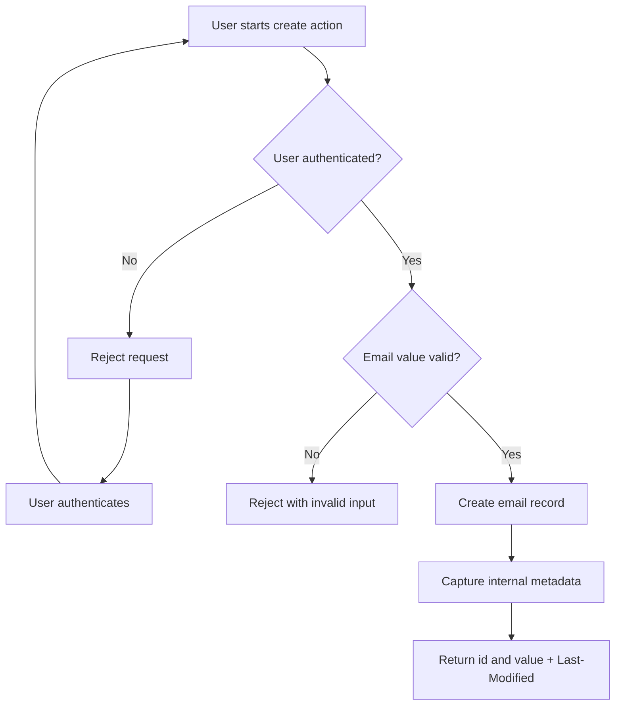

# Feature Guide: Email Records Management (Create Record)

## Metadata
- Functionality: email-records-management
- Created: 2026-05-19
- Updated: 2026-05-19
- Author Agent: Product Owner
- Related User Stories: US-0001
- Related Requirements: REQ-0001, REQ-0002, REQ-0003, REQ-0004

---

## Overview
This feature lets an authenticated business user create a new email record so it can be tracked and managed in the business system.

When creation succeeds, the system returns a new record identifier and the email value. The system also records internal audit details (who created the record and when) to support accountability.

### Key Benefits
- Register new communication addresses quickly.
- Keep ownership and timestamp history for compliance and follow-up.
- Prevent unauthenticated creation attempts.

---

## Key Concepts

### Email Record
A business entry that stores one communication email value and a unique identifier.

### Authenticated User
A user who has valid access credentials and is allowed to create records.

### Last-Modified
A response header showing the creation timestamp for the newly created record.

### Internal Metadata
Operational details captured by the system (created date, created by, updated date, updated by). These details are stored internally and are not shown in the response body.

---

## How-To Guides

### Guide 1: Create a New Email Record
Use this flow when you need to add a new email address to the business records.

**Prerequisites:**
- You are authenticated.
- You have a valid email value.

**Steps:**
1. Open the email records creation action in your workflow.
2. Enter the email value you want to register.
3. Submit the creation request.
4. Confirm the returned record includes an identifier and the value.

**Result:**
A new email record is created and tracked with internal audit information.

### Guide 2: Handle Rejected Creation Attempts
Use this when a create action is rejected.

**Prerequisites:**
- A creation attempt returned an error.

**Steps:**
1. If the response indicates unauthorized access, authenticate and retry.
2. If the response indicates invalid input, correct the email value and retry.
3. If the issue continues, capture the response details and contact support.

**Result:**
The issue is resolved through authentication or input correction, or escalated with enough context.

---

## Examples

### Example 1: Sales Operations Adds a New Contact Email
**Scenario:**
A sales operations user needs to register a new partner contact email.

**How to use the feature:**
1. The user signs in with valid credentials.
2. The user submits the new email value.
3. The system creates the record and returns id + value.
4. The user confirms creation from the successful response.

**Expected outcome:**
The email record exists and can be used in downstream business processes.

### Example 2: Unauthenticated Attempt Is Blocked
**Scenario:**
A user tries to create a record without valid access.

**How to use the feature:**
1. The user submits a create request without authentication.
2. The system rejects the action.
3. The user authenticates and retries.

**Expected outcome:**
No record is created until the user is authenticated.

---

## Workflows

---

## Tips & Best Practices
- Validate the email value before submitting to reduce retries.
- Use authenticated sessions for all create actions.
- Treat the returned identifier as the reference for future read, update, and delete actions.

---

## Troubleshooting / FAQ

**Q: Why was my create request rejected?**
A: Common causes are missing authentication or invalid input. Authenticate first, then verify the email value and retry.

**Q: Why do I only see id and value in the response body?**
A: The feature intentionally exposes only business fields needed by users. Internal metadata is captured by the system for audit purposes.

**Q: How can I confirm when the record was created?**
A: Check the Last-Modified response header.

---

## Related Resources
- [User Story: US-0001 - Create Email Record](../../../user-stories/email-records-management/US-0001-create-email-record.md)
- [Requirement: REQ-0001 - Email Records CRUD Lifecycle](../../../requirements/REQ-0001-email-crud-api.md)
- [Requirement: REQ-0002 - Authenticated Email Access](../../../requirements/REQ-0002-authenticated-email-access-and-audit.md)
- [Requirement: REQ-0003 - Email Record Response Fields Contract](../../../requirements/REQ-0003-email-record-response-fields-contract.md)
- [Requirement: REQ-0004 - Email Record Audit Attribution](../../../requirements/REQ-0004-email-audit-attribution.md)
- [E2E Test Case: E2E-0001 - Create Email Record](../../../e2e/email-records-management/E2E-0001-create-email-record.md)
