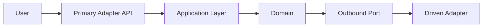

# Project Architecture Overview

## Metadata
- Updated: YYYY-MM-DD
- Author Agent: Software Architect
- Related User Stories: US-XXXX
- Related Technical Requirements: TREQ-XXXX

## Architectural Style and Principles
- Style: <Hexagonal / modular monolith / etc.>
- Principles: <SOLID, low coupling, high cohesion, explicit contracts>

## System Context
- Primary actors: <users/systems>
- External systems and dependencies: <services, providers, infrastructure>

## Reader Guide
- Who should read this: <product, QA, developers, operations>
- What to read first: <top 2 sections for quick understanding>
- Glossary: <short definitions for unavoidable jargon>

## Module and Boundary Map
- Module: <name>
  - Responsibility: <description>
  - Owns: <entities/use-cases>
  - Depends on: <other modules/contracts>

## Runtime Interaction Flows
- Flow: <name>
  - Trigger: <event/request>
  - Path: <adapter -> application -> domain -> ports -> driven adapters>
  - Output/side effects: <result>

## Visual Diagrams (use when possible)
- Context diagram: <Mermaid>
- Module/container diagram: <Mermaid>
- Critical sequence diagram: <Mermaid>

## Technology Baseline
- Runtime/frameworks: <stack>
- Data storage: <database and rationale>
- Messaging/integration: <if any>
- Cross-cutting: <auth, audit, logging, observability, config>

## Decision Log Summary
- TREQ-XXXX: <decision summary + status>

## Risks and Hotspots
- Risk: <risk>
  - Mitigation: <mitigation>

## Open Questions
- <question pending requester decision>
