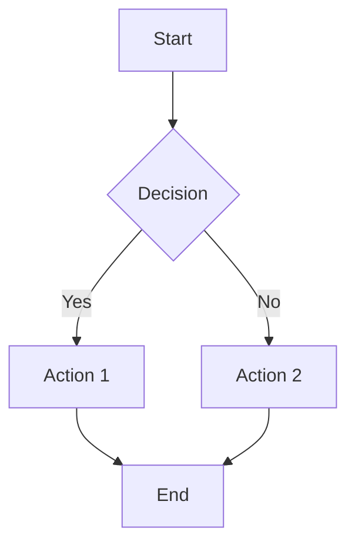

# Feature Guide: <Functionality Name>

## Metadata
- Functionality: <functionality name>
- Created: YYYY-MM-DD
- Updated: YYYY-MM-DD
- Author Agent: Product Owner
- Related User Stories: US-XXXX, US-YYYY
- Related Requirements: REQ-XXXX, REQ-YYYY

---

## Overview
<Write a clear, non-technical summary of what this feature does and why users need it>

### Key Benefits
- <Benefit 1>
- <Benefit 2>
- <Benefit 3>

---

## Key Concepts
<Explain the main concepts users need to understand, using business language>

### Term 1
<Definition and context>

### Term 2
<Definition and context>

---

## How-To Guides

### Guide 1: <User Goal>
<Step-by-step instructions for a common workflow>

**Prerequisites:**
- <Prerequisite 1>

**Steps:**
1. <Step 1>
2. <Step 2>
3. <Step 3>

**Result:** <What the user can expect>

### Guide 2: <User Goal>
<Step-by-step instructions for another common workflow>

---

## Examples

### Example 1: <Real-World Scenario>
**Scenario:** <Describe a realistic business situation>

**How to use the feature:**
1. <Action 1>
2. <Action 2>
3. <Action 3>

**Expected outcome:** <Result>

### Example 2: <Real-World Scenario>
**Scenario:** <Describe a different realistic business situation>

**How to use the feature:**
1. <Action 1>
2. <Action 2>

**Expected outcome:** <Result>

---

## Workflows
<Add diagrams (Mermaid preferred) showing key workflows>

---

## Tips & Best Practices
- <Tip 1 for optimal usage>
- <Tip 2 for avoiding common mistakes>
- <Tip 3 for advanced use>

---

## Troubleshooting / FAQ

**Q: Common question?**
A: Clear answer with steps to resolve

**Q: Another common issue?**
A: Clear answer with workaround

---

## Related Resources
- [User Story: <Title>](../../user-stories/<functionality>/US-XXXX.md)
- [Requirement: <Title>](../../requirements/REQ-XXXX.md)
- [Link to related documentation]
